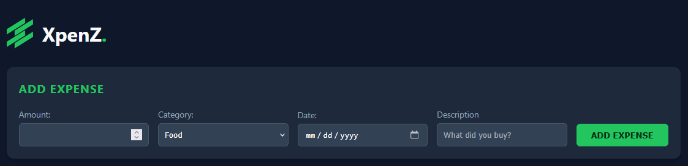
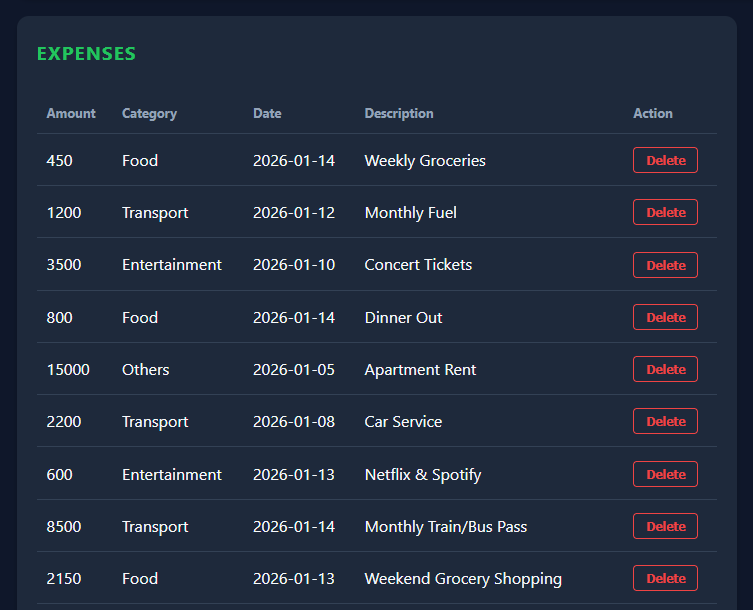

# XpenZ – Expense Tracker with Visual Insights
A JavaScript-based web application that tracks expenses, calculates insights, and visualizes spending trends.

---

# Project Overview 
XpenZ allows users to add, view, and analyze expenses in real-time. Users can:
- Add, edit, and delete expenses
- See total and category-wise spending
- Get monthly summaries and highest spending alerts
- Visualize data with pie and bar charts

---

# Features
Expense input with amount, category, date, description
Persistent data using LocalStorage
Category-wise and monthly summaries
Interactive charts (Chart.js)
Highest spending alert

---

# Technologies Used
- HTML5, CSS3
- JavaScript (Vanilla JS)
- Chart.js
- LocalStorage

---

# Folder Structure

XpenZ/
│
├── index.html
├── css/
│   └── style.css
├── js/
│   ├── app.js
│   └── charts.js
├── assets/
│   └── screenshots/
└── README.md

---

## Screenshots

### Expense Input

### Expense Table

### Analytics Chart
.png)
.png)
.png)

### Full View - Homepage
.png)
.png)

---

# How to Use
- Open index.html in browser
- Add expenses using the input form
- View updated table, summaries, and charts
- Delete expenses if needed

---

# Future Enhancements
- Add user authentication
- Export monthly reports as CSV
- Dark mode toggle
- Budget limit alerts

